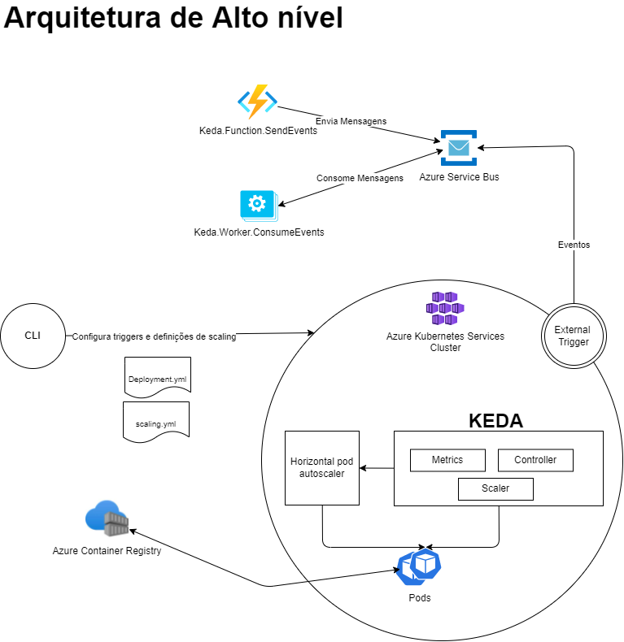
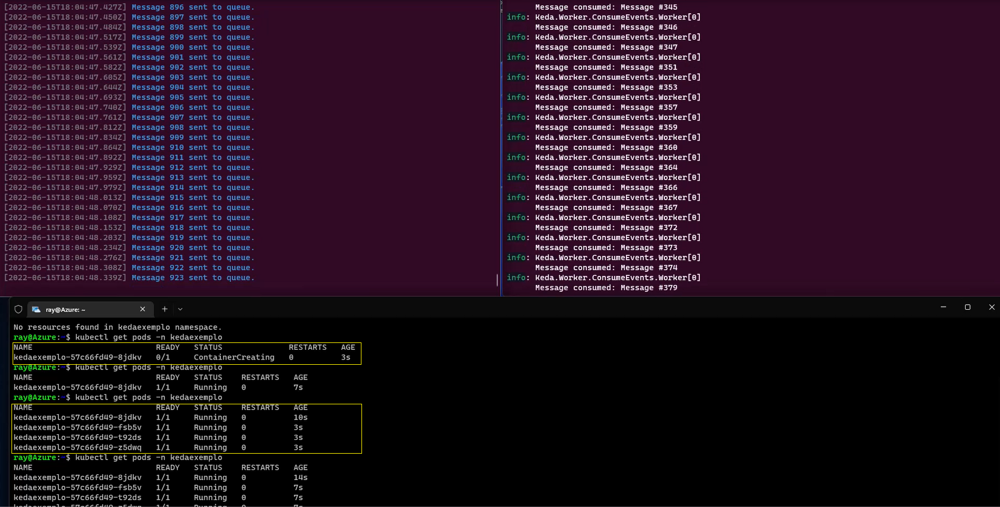

# Introdução 

Um cluster Kubernetes necessita de recursos computacionais para rodar as aplicações e esses recursos normalmente podem aumentar ou diminuir baseado em cargas de trabalho ou eventuais picos de utilização das aplicações. Esse termo normalmente é denominado como "escala".
A escala nesse contexto pode ser realizada no próprio cluster ou a nível de aplicação.

Em cenários de aumento de carga, seja por tráfego maior nas aplicações, é possível escalarmos as aplicações de forma "horizontal", ou seja, criando novas instâncias para atender a demanda sem acréscimo de memória ou CPU.

No Kubernetes podemos utilizar o recurso do [Horizontal Pod Autoscaling](https://kubernetes.io/docs/tasks/run-application/horizontal-pod-autoscale/) para atualizar automaticamente a carga de trabalho de algum recurso, ajustando a escala para atender as métricas especificadas.

Com o [KEDA](https://keda.sh/) podemos estender as funcionalidades do Horizontal Pod Autoscaling e trabalhar com [Arquiteturas baseadas em eventos](https://docs.microsoft.com/en-us/azure/architecture/guide/architecture-styles/event-driven).

## Pré-requisitos

Para uma total compreensão desse artigo ou realização de uma demo em seu ambiente é necessário entender os conceitos e provisionar uma fila no [Azure Service Bus](https://docs.microsoft.com/pt-br/azure/service-bus-messaging/service-bus-messaging-overview), um cluster no [AKS](https://azure.microsoft.com/pt-br/services/kubernetes-service/), um [Azure Container Registry](https://azure.microsoft.com/en-us/services/container-registry/) e saber como utilizar o terminal [Azure Cloud Shell](https://docs.microsoft.com/en-us/azure/cloud-shell/overview).

## KEDA (Kubernetes Event-driven Autoscaling)

O [KEDA](https://keda.sh/) é um autoscaler do Kubernetes, com ele podemos realizar a escala de qualquer container no Kubernetes baseado em uma série de possíveis eventos que possam ocorrer e que precisarão de processamento. O KEDA é um componente que pode ser adicionado a qualquer cluster Kubernetes e pode estender as funcionalidades do [Horizontal Pod autoscaler](https://kubernetes.io/docs/tasks/run-application/horizontal-pod-autoscale/).

Alguns dos scalers disponíveis podem ser encontrados na [documentação oficial](https://keda.sh/docs/2.7/scalers/).

## Arquitetura em alto nível da proposta

Em um alto nível, o KEDA provê um componente que ativa e desativa um deployment para escalar ou desprovisionar os recursos quando não existem mais eventos. O KEDA também provê um serviço de métricas que expõe os eventos, tal como uma fila, um tópico, métricas de CPU ou memória, por exemplo. Abaixo, veremos a proposta de arquitetura de solução para esse cenário:



No exemplo da arquitetura proposta acima temos uma [Azure Function](https://docs.microsoft.com/en-us/azure/azure-functions/) que envia mensagens para um [Azure Service Bus](https://docs.microsoft.com/pt-br/azure/service-bus-messaging/service-bus-messaging-overview) e um serviço (worker) em [.NET 6](https://dotnet.microsoft.com/en-us/download/dotnet/6.0) que executa em background e consome as mensagens de forma assíncrona.

Para que o autoscale funcione, é necessário instalar o KEDA no cluster Kubernetes e criar um Deployment e um ScaledObject. Veremos mais a frente os detalhes da implementação desse cenário. O KEDA praticamente executa duas ações com o Kubernetes:

1. Agent: o KEDA ativa ou desativa os deployments do Kubernetes para escalar
2. Metrics Adapter: Responsável por expor os dados dos eventos para o Horizontal Pod Autoscaler visando a escala.

## Instalação do KEDA em um cluster Kubernetes

No AKS, ao criar um cluster, temos disponível o [HELM (gerenciador de pacote do Kubernetes)](https://helm.sh/). Abra um terminal [Azure Cloud Shell](https://docs.microsoft.com/en-us/azure/cloud-shell/overview) e faça login no seu cluster Kubernetes, em seguida, execute os seguintes comandos:

```powershell
helm repo add kedacore https://kedacore.github.io/charts
helm repo update
kubectl create namespace keda
helm install keda kedacore/keda --namespace keda
```

Os comandos deverão fazer download do pacote do KEDA em seu cluster e criar os pods dentro do namespace keda. Para verificar execute o comando a seguir:

```powershell
kubectl get pod -n keda
```

## Download do projeto exemplo

O projeto exemplo desse artigo pode ser encontrado nesse [repositório](https://github.com/rcarneironet/lab_aks_keda) no Github. O código aqui disponibilizado é meramente para efeitos de experimentação e não representa uma recomendação de código pronto para produção pela Microsoft.

## Configuração dos projetos

Primeiro será necessário criar um Azure Service Bus e [criar uma fila](https://docs.microsoft.com/en-us/azure/service-bus-messaging/service-bus-quickstart-portal) com o nome de "kedafila".

Em seguida, após baixar o código exemplo, obtenha a connection string do Service Bus e configure os projetos "Keda.Function.SendEvents" e "Keda.Worker.ConsumeEvents", basta informar sua connection string do Azure Service Bus em ambos os projetos. Na estrutura do projeto temos também os arquivos "deployment.yml", "scaling.yml" e "secret.yml", será necessário incluir a connection string do Azure Service Bus nesses arquivos, sendo alguns deles em [base64](https://en.wikipedia.org/wiki/Base64).

Também será necessário criar um container de alguma aplicação e enviar uma imagem para o seu ACR. [Maiores detalhes de como fazer pode ser encontrado nesse artigo](https://docs.microsoft.com/pt-br/azure/container-registry/container-registry-get-started-docker-cli?tabs=azure-cli). Em seguida, informe o caminho da imagem criada no arquivo "deployment.yml".

Lembre-se também de habilitar a comunicação entre o cluster AKS e o Azure Container Registry, caso não tenha feito utilizando o comando abaixo:

```powershell
az aks update -n <seu_cluster> -g <seu_resource_group> --attach-acr <seu_acr>
```

## Execução dos deployments no AKS

Com a imagem pronta no Container Registry, faremos a implantação do deploy com o comando abaixo:

```powershell
kubectl apply -f deployment.yml -n kedaexemplo
```

Verifique se o pod foi criado:

```powershell
kubectl get pod -n kedaexemplo
```

Agora faremos a configuração do arquivo scaling.yml para que o KEDA monitore a fila do Service Bus baseado nas configurações citadas no arquivo. Aplicaremos essas configurações com o comando abaixo:

```powershell
kubectl apply -f scaling.yml -n kedaexemplo
```

e verifique se o ScaleObject está com o status READY igual a TRUE. Isso significa que está tudo certo para realizar o autoscaling.

```powershell
kubectl get scaledobjects -n kedaexemplo
```

## Execução da demo

Se todas as etapas acima citadas tiveram êxito, execute os projetos "Keda.Function.SendEvents" e "Keda.Worker.ConsumeEvents". O projeto que contém a Azure Function fará um loop e enviará mensagens para a fila do Service Bus e o segundo é um worker que fará o consumo das mesmas.

Recomenda-se enviar um número considerável de mensagens para que possamos observar o comportamento de autoscaling dos Pods, que serão criados para atender a demanda de mensagens enviadas para o Service Bus. Durante a execução dos projetos, observe a criação dos Pods executando o comando:

```powershell
kubectl get pod -n kedaexemplo
```

O resultado da execução será conforme figura abaixo, onde a escala horizontal acontece mediante os parâmetros informados na configuração do KEDA no cluster do Kubernetes. A medida que as mensagens são enviadas para a fila, o autoscale (up e down) acontece para atender a carga de trabalha que nesse cenário é baseada em eventos.



## Considerações Finais

A estratégia citada nesse artigo visa realizar autoscaling em clusters Kubernetes em cenários de event-driven, provisionando a infraestrutura necessária para atender as demandas em picos de utilização de recursos e maximizando custos de processamento na infraestrutura.